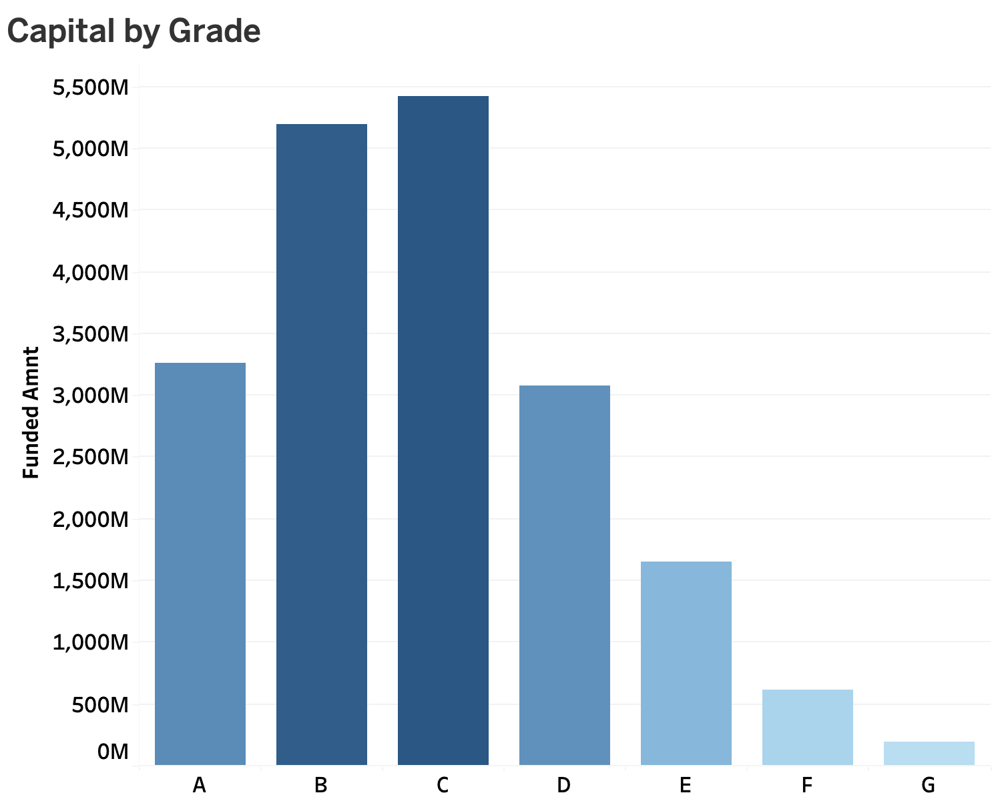
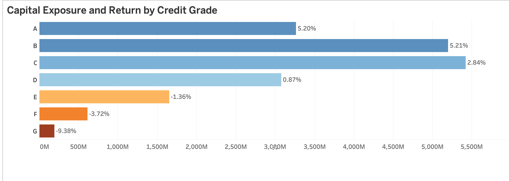

#  Credit Portfolio Performance Analysis — LendingClub (2007–2018)

> **Structural Deterioration Driven by Mispriced Risk, Duration Exposure, and Inefficient Capital Allocation**

##  Project Overview

LendingClub is a U.S.-based peer-to-peer lending platform that connects borrowers with investors, operating as a marketplace lender rather than a traditional bank. Instead of using its own balance sheet, the platform originates personal loans and earns revenue primarily through origination and servicing fees — while **credit risk is borne entirely by investors**.

This project analyzes the performance of LendingClub's loan portfolio between **2007 and 2018**, using approximately **1.35 million loans** (Fully Paid and Charged Off), representing nearly **$19.4 billion in funded capital**.

### Objective

The primary objective is to:

- Determine whether the portfolio **created or destroyed economic value** over time
- Identify the **structural drivers** behind its performance trajectory
- Translate those findings into **actionable insights with measurable financial impact**

At a high level, the portfolio appears profitable, generating approximately **$498 million in net returns** (2.57% weighted return). However, this headline figure masks a deeper issue: profitability is both fragile and inconsistent, driven by rising credit risk, suboptimal pricing, and shifts in portfolio composition over time.

### Analytical Dimensions

Rather than relying solely on aggregate metrics, this analysis decomposes performance across five critical dimensions:

| Dimension | Breakdown | Purpose |
|-----------|-----------|---------|
| **Time** | Origination Year | Evaluate how portfolio quality evolved and detect structural deterioration |
| **Credit Risk** | Borrower Grade (A–G) | Assess whether higher-risk segments are adequately compensated |
| **Capital Exposure** | Funded Capital by Grade | Distinguish between percentage performance and economic impact |
| **Loan Structure** | Term (36 vs 60 months) | Understand the impact of duration on performance |
| **Capital Allocation** | Loan Purpose | Identify which segments drive overall portfolio results |

---

##  Executive Summary

The portfolio exhibits a **clear pattern of performance deterioration** over time, despite continued growth in lending activity.

- **Peak performance**: ~13% return in 2013, reflecting effective risk pricing and controlled expansion
- **Inflection point**: From 2014 onward, returns declined sharply
- **Terminal performance**: Negative returns between 2016–2018, reaching nearly **−9%**
- **Capital allocation concentration**: Debt consolidation alone represents **>60% of total funded volume**
- **Risk mispricing**: Higher-risk segments (Grades D–G) generate negative returns, indicating inadequate risk compensation
- **Capital exposure concentration**: More than half of originated capital was allocated to Grades B and C, while over $3B remained exposed to low-return Grade D loans

> The evidence points to a portfolio that expanded aggressively without sufficient adjustment in pricing, underwriting standards, or risk controls.

---

## 1. Portfolio Evolution Over Time

Portfolio returns improved steadily in the early years, reaching a peak of approximately **13% in 2013**. This trend reversed sharply in subsequent years, with returns declining to negative levels between 2016 and 2018.

Lending activity expanded significantly over time, reaching a peak of approximately **$5.5B in 2015**. Following this peak, funding levels declined sharply, falling to approximately **$0.8B by 2018**.

### Key Insight

> The combined analysis reveals a **critical imbalance**: while lending activity increased significantly leading up to 2015, profitability began to deteriorate shortly after. Portfolio expansion was not accompanied by adequate risk control, ultimately leading to declining returns and a contraction in lending activity.

---

## 2. Credit Risk Segmentation — Performance by Grade

Portfolio performance varies significantly across credit grades:

- **Grades A–B**: Stable and positive returns (~5%), indicating effective risk pricing
- **Grade C–D**: Marginal profitability, showing early signs of stress
- **Grades E–G**: Negative returns, indicating that elevated risk levels are not adequately compensated

The heatmap reveals that from **2015 onward**, returns decline across all grades simultaneously. By 2018, all credit grades generate negative returns, with the worst-performing segments reaching losses of approximately **−27.6%**.

This synchronized decline indicates the deterioration is **structural, not segment-specific**.

### Key Insight

> Portfolio deterioration is not driven by isolated high-risk segments, but by a **system-wide degradation in credit performance**. Even traditionally safe segments fail to maintain stable returns over time, suggesting risk increased across the entire portfolio without adequate pricing adjustments.

---

## 3. Capital Exposure — Where the Money Was Actually Invested

While return rates provide valuable information about credit performance, they do not reveal how much capital was exposed to each segment.

The portfolio was heavily concentrated in Grades B and C, each representing more than $5 billion in originated capital. By contrast, Grades F and G accounted for only a small fraction of total exposure.

This distinction is important because poor performance in a small segment may have limited economic consequences, while modest underperformance in a large segment can materially affect portfolio profitability.

### Key Insight

> Credit risk should not be evaluated solely through percentage returns. Capital concentration determines where portfolio outcomes have the greatest economic impact.

---

Combining capital allocation with realized returns reveals a different perspective on portfolio risk.

Although Grade G generated the worst average return (-9.38%), it represented less than $0.2B of total funded capital. Conversely, Grade D represented more than $3 billion in originated capital while producing only a marginal return (~0.87%).

This suggests that improving performance in large capital segments may create more value than focusing exclusively on the worst-performing grades.

### Key Insight

> The greatest economic opportunities are not necessarily located in the worst-performing segments. They are often found where large amounts of capital generate weak risk-adjusted returns.

---

## 4. Loan Structure — Term Impact (36 vs 60 months)

The analysis reveals a **clear performance divergence** between loan terms:

| Term | Peak Return | 2018 Return | Volatility |
|------|------------|-------------|------------|
| 36-month | Lower peak (~10%) | More stable decline | Lower |
| 60-month | Higher peak (~19% in 2013) | −14.6% by 2018 | Significantly higher |

In the early years, 60-month loans delivered higher returns, reflecting the premium yield associated with longer maturities. However, starting in **2015**, this advantage reverses rapidly. Long-term loans turn negative earlier and fall more steeply than their shorter-term counterparts.

### Key Insight

> Longer-duration loans introduce **disproportionate risk without adequate compensation**, making them a structural driver of portfolio underperformance. The additional yield offered by 60-month loans is insufficient to compensate for increased exposure to credit risk over time.

---

## 5. Capital Allocation — Performance by Loan Purpose

The analysis shows that all loan purposes generate positive average returns when evaluated across the full period. However, a **clear imbalance in capital allocation** exists:

- **Debt consolidation**: >60% of total funded volume, yet delivers only moderate returns
- **Credit card refinancing**: Higher returns, but receives significantly lower capital allocation
- The largest segments by volume are **not the most return-efficient** segments

### Key Insight

> Portfolio performance is primarily driven by **large-volume segments rather than high-return segments**. Capital allocation decisions play a critical role in overall profitability — and the current allocation is suboptimal.

---

## 6. Strategic Recommendations

The analysis identified several areas where portfolio performance could potentially be improved. Rather than estimating future financial impact through scenario modeling, the recommendations below compare current performance against internal portfolio benchmarks observed within the dataset.

| Recommendation | Current Performance | Internal Benchmark | Performance Gap | Strategic Action |
|----------------|-------------------:|-------------------:|----------------:|------------------|
| **Optimize Grade D Capital Allocation** | 0.87% return | Grade C: ~2.8% return | +1.93 pp | Reduce exposure to low-return Grade D originations and prioritize capital deployment toward higher-performing segments |
| **Review Long-Term Loan Pricing** | 60m loans: -4.6% return | 36m loans: 1.5% return | +6.1 pp | Apply additional pricing premiums or tighter approval criteria for long-duration loans |
| **Improve Capital Allocation by Purpose** | Debt Consolidation: 2.1% return | Credit Card: 4.5% return | +2.4 pp | Evaluate whether future capital allocation can be diversified toward more efficient loan purposes |
| **Strengthen Risk-Based Pricing** | Grades D–G generate weak or negative returns | Grades A–C maintain positive returns | Structural underperformance | Reassess pricing methodology to better align expected yield with realized credit losses |

### Recommendation 1 — Optimize Grade D Capital Allocation

Grade D represents one of the most important economic segments in the portfolio. While it generated only **0.87% average return**, more than **$3 billion** of funded capital was allocated to this grade.

This finding is particularly important because portfolio profitability is influenced not only by return rates, but also by the amount of capital exposed. A small improvement in a large segment may create more value than a large improvement in a small segment.

### Recommendation 2 — Review Long-Term Loan Pricing

The analysis shows a consistent performance gap between 36-month and 60-month loans. Although longer-term loans initially generated higher returns, their performance deteriorated significantly over time.

By 2018, 60-month loans materially underperformed shorter-duration loans, suggesting that the additional yield charged was insufficient to compensate for the increased duration risk.

### Recommendation 3 — Improve Capital Allocation by Purpose

Debt Consolidation accounts for more than **60% of total funded volume**, making it the dominant portfolio segment. However, it does not generate the strongest returns among available loan purposes.

This suggests an opportunity to improve portfolio efficiency by reviewing how capital is distributed across lending categories.

### Recommendation 4 — Strengthen Risk-Based Pricing

Higher-risk grades consistently underperform lower-risk segments, despite carrying higher nominal interest rates.

The evidence suggests that risk increased faster than pricing adjustments, resulting in persistent deterioration across higher-risk grades. Future pricing reviews should focus on maintaining a sustainable relationship between expected yield and observed credit losses.

---

## Key Findings Summary

| Finding | Evidence | Business Implication |
|----------|----------|----------|
| Portfolio performance peaked at approximately **13% in 2013** and declined to nearly **−9% by 2018** | Portfolio Return Analysis | Portfolio expansion was accompanied by deteriorating credit performance and declining profitability |
| All credit grades deteriorated simultaneously after 2015 | Grade × Year Heatmap | Performance deterioration was systemic rather than isolated to high-risk segments |
| 60-month loans consistently underperformed shorter-duration loans in later years | Loan Term Analysis | Additional yield was insufficient to compensate for increased duration risk |
| Debt Consolidation accounts for **>60% of funded capital** while generating only moderate returns | Capital Allocation by Purpose | Portfolio profitability is heavily influenced by a highly concentrated segment |
| Grades E–G generate weak or negative returns despite higher interest rates | Return by Grade Analysis | Risk pricing appears insufficient in higher-risk segments |
| Grade D holds **>$3B in funded capital** while generating only **~0.87% average return** | Capital Exposure Analysis | Large capital concentrations may create greater economic impact than the worst-performing grades |

---

## Limitations & Caveats

- Return metrics are **not time-adjusted** (no IRR or NPV calculation).
- Results are based on **realized historical performance** and should not be interpreted as forecasts of future portfolio performance.
- The analysis may be affected by **cohort maturity effects** in the most recent vintages (2017–2018), as some loans may not have reached full maturity before the end of the observation period.
- Portfolio performance is evaluated at the loan level and does not account for investor-specific cash flow timing.
- **Macroeconomic factors** (e.g., interest rates, unemployment, economic cycles) are not incorporated into the analysis.
- The study focuses on identifying performance drivers and capital allocation inefficiencies rather than building predictive credit risk models.

---