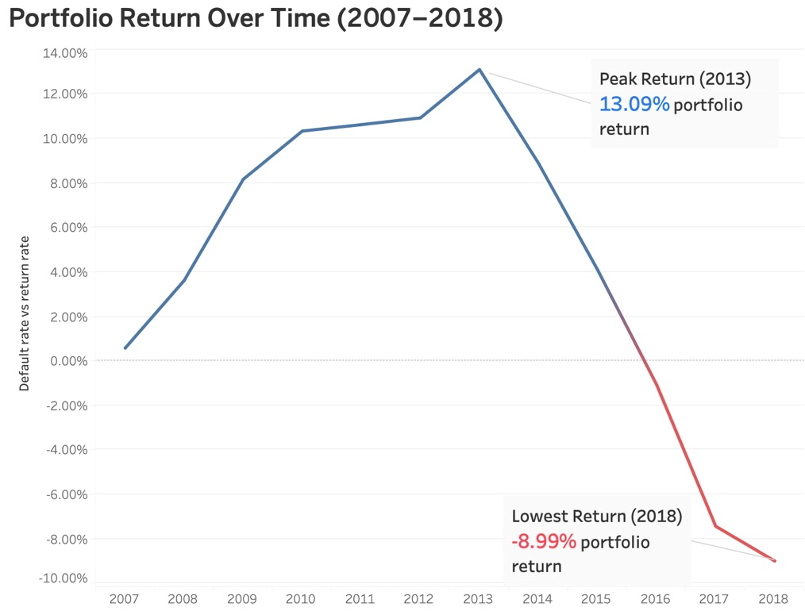
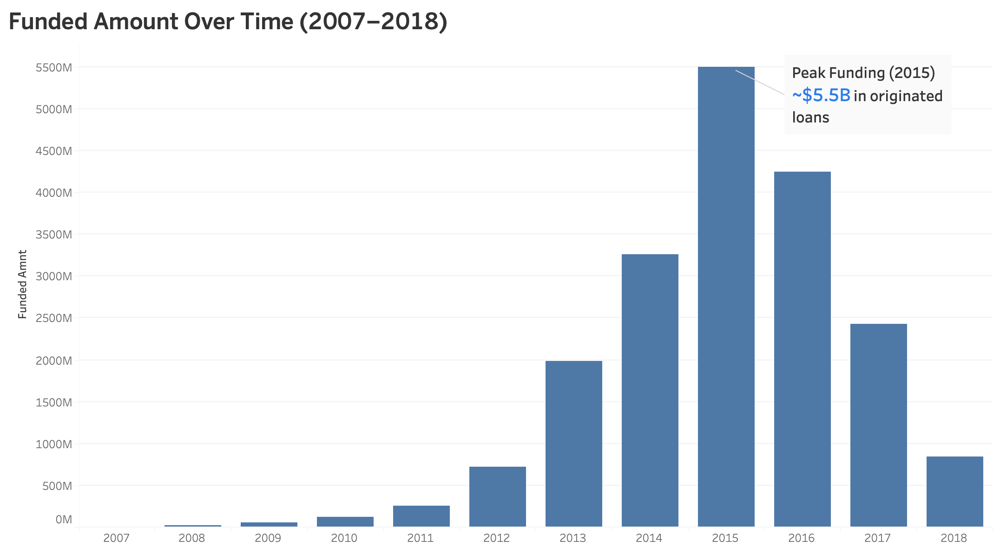
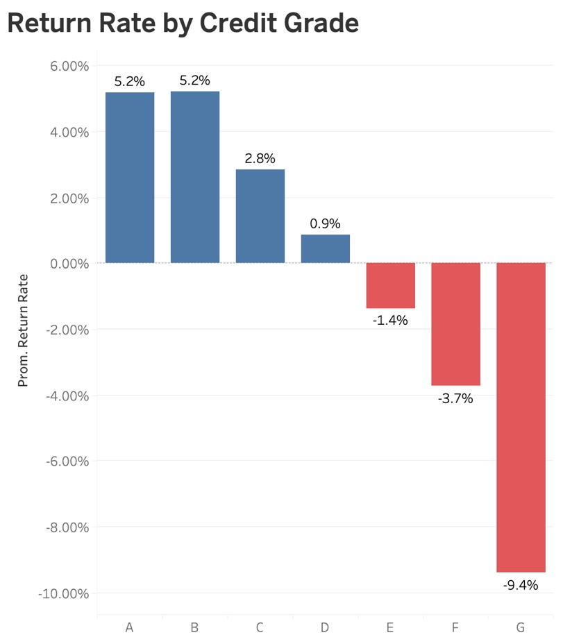
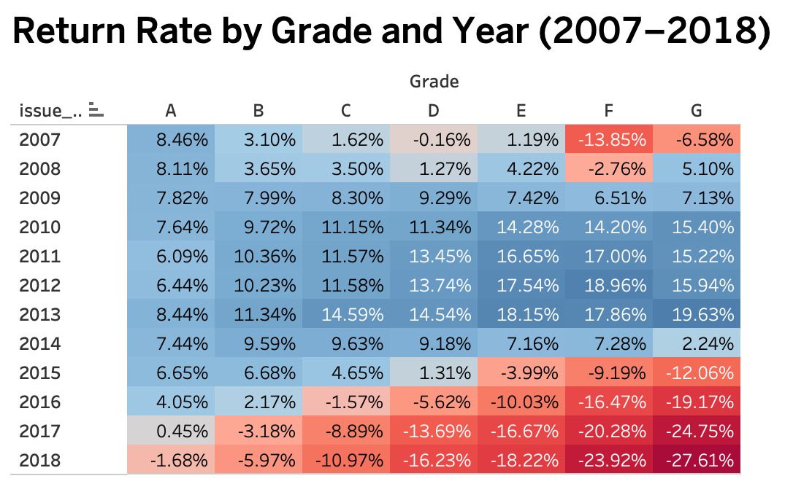
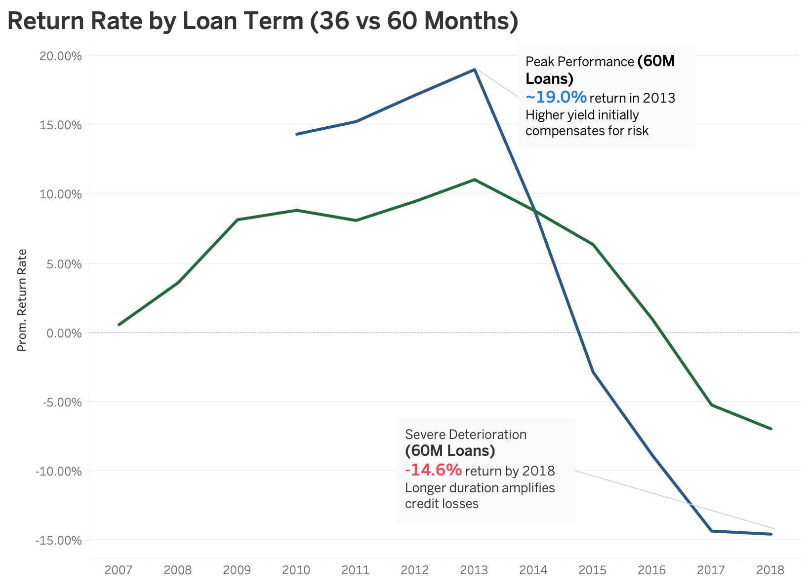
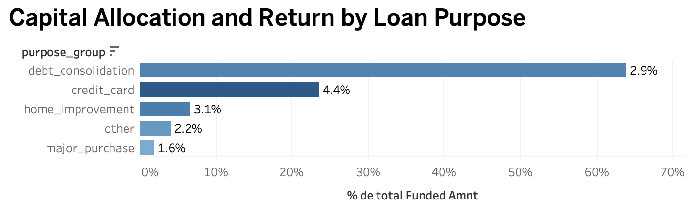

#  Credit Portfolio Performance Analysis — LendingClub (2007–2018)

> **Structural Deterioration Driven by Mispriced Risk, Duration Exposure, and Inefficient Capital Allocation**


-eab308?style=flat-square)
-dc2626?style=flat-square)


---

> [!NOTE]
> **Key Metrics at a Glance**
>
> | Metric | Value |
> |--------|-------|
> | 📁 Total Loans Analyzed | ~1,350,000 |
> | 💵 Total Funded Capital | ~$19.4 Billion |
> | 📈 Net Returns Generated | ~$498 Million |
> | 📉 Weighted Portfolio Return | 2.57% |
> | 🏆 Peak Return Year | 2013 (~13%) |
> | ⚠️ Terminal Return (2018) | ~−9% |
> | 💰 Estimated Value Recovery | +$204.75M |
> | 🕐 Analysis Period | 2007 – 2018 |

---

##  Project Overview

LendingClub is a U.S.-based peer-to-peer lending platform that connects borrowers with investors, operating as a marketplace lender rather than a traditional bank. Instead of using its own balance sheet, the platform originates personal loans and earns revenue primarily through origination and servicing fees — while **credit risk is borne entirely by investors**.

This project analyzes the performance of LendingClub's loan portfolio between **2007 and 2018**, using approximately **1.35 million loans** (Fully Paid and Charged Off), representing nearly **$19.4 billion in funded capital**.


### Objective

The primary objective is to:

- Determine whether the portfolio **created or destroyed economic value** over time
- Identify the **structural drivers** behind its performance trajectory
- Translate those findings into **actionable insights with measurable financial impact**

At a high level, the portfolio appears profitable, generating approximately **$498 million in net returns** (2.57% weighted return). However, this headline figure masks a deeper issue: profitability is both fragile and inconsistent, driven by rising credit risk, suboptimal pricing, and shifts in portfolio composition over time.

### Analytical Dimensions

Rather than relying solely on aggregate metrics, this analysis decomposes performance across four critical dimensions:

| Dimension | Breakdown | Purpose |
|-----------|-----------|---------|
| **Time** | Origination Year | Evaluate how portfolio quality evolved and detect structural deterioration |
| **Credit Risk** | Borrower Grade (A–G) | Assess whether higher-risk segments are adequately compensated |
| **Loan Structure** | Term (36 vs 60 months) | Understand the impact of duration on performance |
| **Capital Allocation** | Loan Purpose | Identify which segments drive overall portfolio results |

---

##  Executive Summary

The portfolio exhibits a **clear pattern of performance deterioration** over time, despite continued growth in lending activity.

- **Peak performance**: ~13% return in 2013, reflecting effective risk pricing and controlled expansion
- **Inflection point**: From 2014 onward, returns declined sharply
- **Terminal performance**: Negative returns between 2016–2018, reaching nearly **−9%**
- **Capital concentration**: Debt consolidation alone represents **>60% of total funded volume**
- **Risk mispricing**: Higher-risk segments (Grades D–G) generate negative returns, indicating inadequate risk compensation

> The evidence points to a portfolio that expanded aggressively without sufficient adjustment in pricing, underwriting standards, or risk controls.

---

## 1. Portfolio Evolution Over Time



Portfolio returns improved steadily in the early years, reaching a peak of approximately **13% in 2013**. This trend reversed sharply in subsequent years, with returns declining to negative levels between 2016 and 2018.


Lending activity expanded significantly over time, reaching a peak of approximately **$5.5B in 2015**. Following this peak, funding levels declined sharply, falling to approximately **$0.8B by 2018**.

### Key Insight

> The combined analysis reveals a **critical imbalance**: while lending activity increased significantly leading up to 2015, profitability began to deteriorate shortly after. Portfolio expansion was not accompanied by adequate risk control, ultimately leading to declining returns and a contraction in lending activity.

---

## 2. Credit Risk Segmentation — Performance by Grade


Portfolio performance varies significantly across credit grades:

- **Grades A–B**: Stable and positive returns (~5%), indicating effective risk pricing
- **Grade C–D**: Marginal profitability, showing early signs of stress
- **Grades E–G**: Negative returns, indicating that elevated risk levels are not adequately compensated



The heatmap reveals that from **2015 onward**, returns decline across all grades simultaneously. By 2018, all credit grades generate negative returns, with the worst-performing segments reaching losses of approximately **−27.6%**.

This synchronized decline indicates the deterioration is **structural, not segment-specific**.

### Key Insight

> Portfolio deterioration is not driven by isolated high-risk segments, but by a **system-wide degradation in credit performance**. Even traditionally safe segments fail to maintain stable returns over time, suggesting risk increased across the entire portfolio without adequate pricing adjustments.

---

## 3. Loan Structure — Term Impact (36 vs 60 months)



The analysis reveals a **clear performance divergence** between loan terms:

| Term | Peak Return | 2018 Return | Volatility |
|------|------------|-------------|------------|
| 36-month | Lower peak (~10%) | More stable decline | Lower |
| 60-month | Higher peak (~19% in 2013) | −14.6% by 2018 | Significantly higher |

In the early years, 60-month loans delivered higher returns, reflecting the premium yield associated with longer maturities. However, starting in **2015**, this advantage reverses rapidly. Long-term loans turn negative earlier and fall more steeply than their shorter-term counterparts.

### Key Insight

> Longer-duration loans introduce **disproportionate risk without adequate compensation**, making them a structural driver of portfolio underperformance. The additional yield offered by 60-month loans is insufficient to compensate for increased exposure to credit risk over time.

---

## 4. Capital Allocation — Performance by Loan Purpose



The analysis shows that all loan purposes generate positive average returns when evaluated across the full period. However, a **clear imbalance in capital allocation** exists:

- **Debt consolidation**: >60% of total funded volume, yet delivers only moderate returns
- **Credit card refinancing**: Higher returns, but receives significantly lower capital allocation
- The largest segments by volume are **not the most return-efficient** segments

### Key Insight

> Portfolio performance is primarily driven by **large-volume segments rather than high-return segments**. Capital allocation decisions play a critical role in overall profitability — and the current allocation is suboptimal.

---

##  Financial Quantification & Recommendations

All financial impact estimates are derived from **conservative scenario modeling** applied to the post-2013 portfolio ($16.3B in funded capital). Each scenario isolates a single lever and calculates its impact using realized loan-level data — no external assumptions or benchmarks were used.

| Area | Action | BPS Applied | Calculation Basis | Estimated Impact |
|------|--------|-------------|-------------------|-----------------|
| **Duration / Term Policy** | Reduce 60-month loans in D+ to ≤25%, reallocate to 36-month | 675 bps real spread between terms | Return diff (36m: −4.74% vs 60m: −11.49%) applied to 75% of 60m post-2014 capital ($1.58B) | **+$106.9M** |
| **Credit Grade Policy** | Reduce F–G originations by ~50% with partial repricing | +200 bps (covers 13–21% of real gap) | 50% of losses avoided from F–G (−$77M total) + additional yield on retained capital (~$315M) | **+$44.8M** |
| **Underwriting Policy** | Reject high-risk loans (DTI > p75 and FICO < 680) within E–G | N/A | High-risk subset (12.2% of loans, $220M capital) with −13.75% return removed from portfolio | **+$30.35M** |
| **Risk Pricing Model** | Increase interest rates in Grade D (partial repricing) | +87 bps (50% of gap: 174 bps) | Yield–loss gap in Grade D (+174 bps) applied to total Grade D capital ($2.6B) | **+$22.7M** |


>  **Note**: These scenarios are **not additive**. There is overlap between segments, and each scenario isolates a specific lever independently. The estimated impacts represent either avoided losses or incremental income under simplified assumptions.

### Strategic Priority Order

```
1. Duration Control        → $106.9M  (highest structural impact)
2. Grade Exposure Limits   → $44.8M   (mitigates structurally unprofitable segments)
3. Underwriting Filters    → $30.35M  (precise risk control within segments)
4. Yield Repricing         → $22.7M   (incremental, insufficient alone)
```

> The results confirm that **structural levers outperform pricing adjustments**. Portfolio performance is determined not only by how individual loans are priced, but by how risk is structured, allocated, and managed across the entire portfolio.

---

##  Key Findings Summary

| Finding | Evidence | Impact |
|---------|----------|--------|
| Performance peaked in 2013 (~13%) and declined to −9% by 2018 | Historical return chart | Portfolio is structurally deteriorating |
| All credit grades deteriorated simultaneously post-2015 | Grade × Year heatmap | Systemic, not segment-specific failure |
| 60-month loans underperform by ~675 bps vs 36-month | Term comparison chart | Duration risk is underpriced |
| Debt consolidation holds >60% of capital at moderate returns | Capital allocation chart | Inefficient capital deployment |
| F–G grades generate structurally negative returns | Grade return analysis | Risk mispricing across the credit spectrum |

---

##  Limitations & Caveats

- Return metrics are **not time-adjusted** (no IRR calculation)
- Scenario estimates are based on **simplified assumptions** and evaluated independently (non-additive)
- **No behavioral effects** are modeled (e.g., changes in demand after repricing or underwriting changes)
- Pricing scenarios assume **no volume elasticity** (interest rate increases do not reduce loan demand)
- Underwriting analysis is limited to **DTI and FICO**, excluding other relevant risk variables
- **Macroeconomic factors** (e.g., interest rates, economic cycles, unemployment) are not incorporated

---

